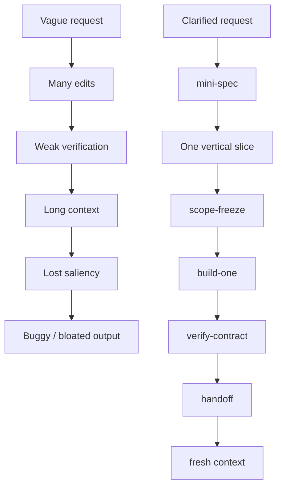

# AI Engineering Skills

[](https://github.com/tmusser/ai-engineering-skills/actions/workflows/ci.yml)
[](LICENSE)
[](https://github.com/tmusser/ai-engineering-skills/releases)
[](https://github.com/tmusser/agent-workflow-bench)

<!-- markdownlint-disable MD013 -->

A compact workflow for shipping small AI-assisted software projects with bounded scope,
durable context, reproducible verification, and fast handoff.

Build with AI like a disciplined team of two: one human sets direction and boundaries;
one agent executes inside them.

Skills do not make agents obey. They make expected behavior explicit, inspectable,
recoverable, and gateable across messy work. Templates preserve state, and
verification records make claims auditable. See
[Why skills, not prompts](docs/why-skills-not-prompts.md).

The point is not to make the agent listen. The point is to make the work legible
when it does not.

**Better specs, not bigger specs.**

**Durable state, not longer chats.**

| Common failure mode | Skill-pack response |
|---|---|
| Vague ask, hidden assumptions, or missing boundary | `grill-with-docs-lite` → `mini-spec` |
| Scope expands while coding | `scope-freeze` |
| Change is treated as done without evidence | `test-mini` → `verify-contract` |
| Fresh session loses the thread | `handoff` |

## Start here

This repo helps agents stop wandering, prove what changed, and preserve handoff state.

Use it when work is too consequential for ad hoc prompting but too small for a PRD.

The smallest starter loop is:

```text
mini-spec -> scope-freeze -> build-one -> verify-contract -> handoff
```

Recommended starter set:

- `mini-spec`
- `scope-freeze`
- `build-one`
- `verify-contract`
- `handoff`

`thin-plan` is recommended when a slice needs more shape, but it is intentionally not
part of the absolute starter path.

## Try the starter install

Clone the repo, then install the starter set:

```bash
git clone https://github.com/tmusser/ai-engineering-skills.git
cd ai-engineering-skills
./install.sh --claude-user --only mini-spec,scope-freeze,build-one,verify-contract,handoff
./install.sh --codex-user --only mini-spec,scope-freeze,build-one,verify-contract,handoff
```

For project-scoped installs, templates, and the raw Python installers, see
[Claude Code installation](docs/claude-code-installation.md) and
[Codex installation](docs/codex-installation.md).

Those docs cover `scripts/install_claude_code.py`, `scripts/install_codex.py`,
`AI_ENGINEERING_SKILLS_VERSION.json`, `--dry-run`, `--backup`, `--force`, `--only`,
`--uninstall`, and `--include-templates`.

## What it creates

| Artifact | What it means |
| --- | --- |
| `SPEC.md` | Current contract |
| `VERIFY.md` | Proof ledger / verify gate |
| `HANDOFF.md` | Fresh-session resume packet |

## Why this exists

AI coding agents are powerful, but sessions still fail for predictable reasons:

- vague requests become plausible but wrong plans
- scope expands quietly
- weak verification gets accepted as completion
- long contexts hide the important constraint
- handoff state disappears between sessions

`ai-engineering-skills` gives the human and agent shared boundaries, checks, and
durable artifacts. It reduces risk, but it does not replace judgment.

## Why every skill includes anti-patterns

Common failures are predictable: implementing before clarifying, expanding scope,
touching unrelated files, debugging without reproduction, mistaking execution for
correctness, and losing context between sessions.

## Evidence

**Proof artifact:** this repo is evaluated by
[`agent-workflow-bench`](https://github.com/tmusser/agent-workflow-bench), a small
standalone benchmark for agent skills, verification artifacts, and fresh-session
resumability.

The benchmark asks a narrower question: when an agent completes messy technical
work, does it leave enough verified context for another fresh session to trust,
audit, and continue it?

| Task | What it shows |
| --- | --- |
| Task 4 — Impossible Churn Regression | Skill-routed runs can leave durable context for audit/resume. |
| Task 5 — Fake Data Campaign Lift Trust | Clearer audit trails help inspection, but do not guarantee correctness. |
| Task 7 — Dashboard Export Scope Pressure | Stronger settings saturated on behavior; weaker settings exposed compatibility and test-integrity failures. |

Supported claims:

- auditability
- verification discipline
- resumability

Not supported:

- broad pass-rate superiority
- guaranteed correctness
- universal behavior improvement

The Task 7 follow-up suggested the highest-leverage improvement was not heavier
skills, but sharper invalidation: compatibility probes, diff guards, and
`REVIEW_REQUIRED` states.

See [docs/benchmark-findings.md](docs/benchmark-findings.md) for the fuller pilot
notes.

## Skill map

See [docs/skill-map.md](docs/skill-map.md) for the routing diagram, context-pressure
layer, failure-mode diagram, and workflow recipes.

## The failure mode this avoids



This is the shape the repo is trying to prevent. For the full routing map, see
[docs/skill-map.md](docs/skill-map.md).

## How this is different

- Raw prompting gives instructions. This repo leaves durable artifacts.
- Plan Mode approves a plan. This repo adds earlier and later gates.
- Chat scrollback disappears. Files survive the session.

## Common objections

### Isn't this just better prompting?

Better prompts help, but the artifact trail is the leverage: specs, scope boundaries,
verification records, and handoff notes.

### Is this process theater?

It can be if you use too much of it. Start with the five-gate starter and skip the
workflow for tiny reversible edits.

### Will agents ignore the skills?

Sometimes. Skills do not make agents obey. They make expected behavior explicit,
inspectable, and easier to correct when the agent drifts. See
[Limitations](LIMITATIONS.md) for the honest failure modes.

## Context-pressure control layer

Four skills form the backbone for resilient agent sessions:

- `scope-freeze` — limits blast radius before work
- `verify-contract` — records evidence after work
- `context-check` — detects drift during work
- `handoff` — preserves durable state between sessions

Together they support bounded execution and verifiable progress.

`lean-mode` is optional. It changes communication density, not the project workflow.
Use it when token budget matters, then switch back to full reasoning when ambiguity,
safety, or trade-offs require more explanation.

`context-check` is an optional passive guardrail. It watches for drift, compaction
pressure, and active-mode loss, then recommends the smallest corrective action.

For scheduled or delegated tool-using runs, see
[Agent-worker safety](docs/agent-worker-safety.md) before giving a workflow write
access.

## Workflow recipes

See [docs/recipes.md](docs/recipes.md) for the small-project, debug, ML/dashboard,
analytical, and cross-functional recipes.

## Ceremony ladder

Use the smallest workflow that still feels safe.

### Level 0 — Patch

Tiny reversible edit. Run one sanity check. Record the result.

### Level 1 — Micro

One bounded slice. `inline scope-freeze -> build-one -> verify-contract`.

### Level 2 — Mini

Small vertical slice. `mini-spec -> optional thin-plan -> scope-freeze ->
build-one -> test-mini -> verify-contract`.

Analytical deliverables such as sizing memos or scenario tables often fit Level 2.

### Level 3 — Full

User-facing, scheduled, autonomous, decision-impacting, data-sensitive, or
multi-slice work. `grill-with-docs-lite -> mini-spec -> checklist-mini -> thin-plan
-> scope-freeze -> analyze-mini -> build-one -> test-mini -> verify-contract ->
ship-mini -> handoff`.

### Below Level 0 — Prompt primitives

Some tasks do not need a skill, artifact, or workflow gate. For quick steering moves
like “Find the lie,” “Smallest safe diff,” or “Test the tests,” use prompt primitives
instead. See [docs/recipes.md#prompt-primitives](docs/recipes.md#prompt-primitives).

## Optional bundles

Use the smallest bundle that fits. See [docs/bundles.md](docs/bundles.md) for
copy-paste install sets for starter, bugfix, ML/data science, dashboard,
agent-worker, and full governance workflows.

## Demo


This sanitized terminal demo shows a bounded cycle using fake data and simulated
agent output. It is generated from `demo/demo.tape` using VHS, so it is reproducible
and does not require private data, API keys, or a real Claude Code session.

Render it with:

```bash
scripts/render_demo.sh
```

## Part of the suite

This repo is one piece of a small set of repos for making AI-assisted work clearer,
more bounded, and more verifiable. See [Suite map](docs/SUITE_MAP.md).

| Repo | Primary job | First thing to try |
| --- | --- | --- |
| [ai-engineering-skills](https://github.com/tmusser/ai-engineering-skills) | Bounded, verifiable AI coding work | `mini-spec -> scope-freeze -> build-one -> verify-contract` |
| [context-to-action-skills](https://github.com/tmusser/context-to-action-skills) | Turn messy workplace context into facts and next actions | `reduce-to-facts`, then `clear-ask`, `decision-brief`, `status-update`, or `follow-up-draft` |
| [chart-contract](https://github.com/tmusser/chart-contract) | Auditable analytical charts | Build one chart with an explicit claim, caveat, and source trail |

The shared pattern: clarify first, bound the work, verify the result, preserve
handoff state.

## Docs

- [Benchmark findings](docs/benchmark-findings.md)
- [Why skills, not prompts](docs/why-skills-not-prompts.md)
- [Skill map](docs/skill-map.md)
- [Workflow recipes](docs/recipes.md)
- [Optional bundles](docs/bundles.md)
- [Cross-functional infrastructure coordination](docs/recipes.md#cross-functional-infrastructure-coordination)
- [Claude Code installation](docs/claude-code-installation.md)
- [Codex installation](docs/codex-installation.md)
- [Compatibility confidence](docs/compatibility-confidence.md)
- [Limitations](LIMITATIONS.md)
- [Agent-worker safety](docs/agent-worker-safety.md)
- [Suite map](docs/SUITE_MAP.md)
- [Examples](examples/tiny-bugfix/README.md)

## Slash-style usage

Installed Claude Code skills are invoked directly with `/skill-name`.

Installed Codex skills should be invoked with `$skill-name` or selected through
`/skills` where available.

## License and acknowledgments

This repository is MIT licensed. See `LICENSE`.

This project is independently written and acknowledges inspiration from Addy Osmani's
`agent-skills`, Matt Pocock's `skills`, and GitHub's `spec-kit`. See
`ACKNOWLEDGMENTS.md`.
