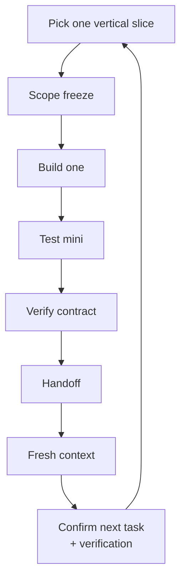
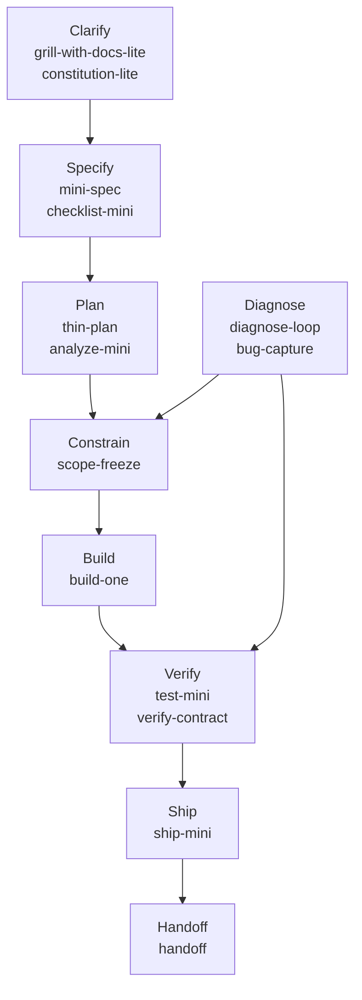
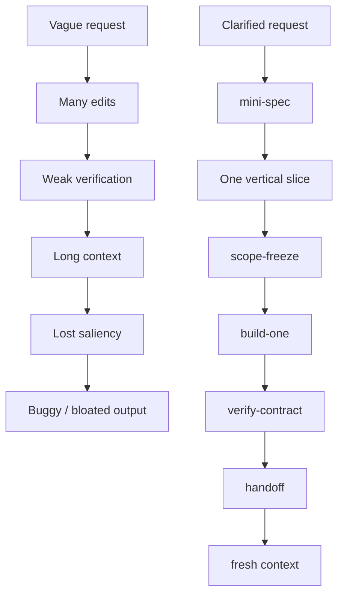

# AI Engineering Skills

A compact workflow for shipping small AI-assisted software projects with bounded scope, durable context, reproducible verification, and fast handoff.

Build with AI like a disciplined team of two: one human setting direction, one agent executing inside clear boundaries.



## Why this exists

AI coding agents are powerful, but sessions often fail for predictable reasons.

Users restart from scratch.

They re-explain context.

Scope expands quietly.

Weak verification gets accepted.

Handoff state disappears between sessions.

`ai-engineering-skills` gives the agent durable working context and a lightweight operating loop.

It does not try to replace judgment. It gives the human and agent a shared set of boundaries, checks, and artifacts.

## Skill map



## Context-Pressure Control Layer

Four skills form the backbone for resilient agent sessions:

- `scope-freeze` — limits blast radius **before** work
- `verify-contract` — records evidence **after** work
- `context-check` — detects drift **during** work
- `handoff` — preserves durable state **between** sessions

Together they enforce bounded execution and verifiable progress.

## The failure mode this avoids



## Demo


This sanitized terminal demo shows a mini-spec → thin-plan → scope-freeze → build-one → verify-contract → handoff cycle using fake data and simulated agent output.

The demo is generated from `demo/demo.tape` using VHS, so it is reproducible and does not require private data, API keys, or a real Claude Code session.

Render it with:

```bash
scripts/render_demo.sh
```

## Try it now

```bash
git clone https://github.com/tmusser/ai-engineering-skills.git
cd ai-engineering-skills
./install.sh
```

Then open Claude Code in a project and run:

```text
/mini-spec
/lean-mode
```

## What this repo is

This repo is a portable skill pack for solo AI engineers, data scientists, and technical builders using coding agents to ship focused tools, ML workflows, agent workflows, dashboards, notebooks, and automation projects.

It is designed for small projects where speed still needs evidence, limits, and handoff notes.

It emphasizes:

- Semantic clarity before implementation
- Mini-specs instead of bloated specs
- Vertical-slice planning
- One-task implementation loops
- Blast-radius control
- Deterministic verification
- Bug diagnosis instead of random fixing
- Handoff and context compression
- Lightweight ship gates for ML, agent, and dashboard workflows

## What this repo is not

This is not a generic prompt collection.

It is not a heavyweight product process.

It is not a replacement for engineering judgment.

It is not tied to one AI coding tool.

Claude Code and Codex are peer targets. Manual install is always available because skills are plain folders with `SKILL.md` files.

`grill-with-docs-lite` is adapted from Matt Pocock's grill skill, but here it feeds durable context files and a readiness judgment for AI-engineering work.

`lean-mode` is optional. It changes communication density, not the project workflow. Use it when token budget matters, then switch back to full reasoning when ambiguity, safety, or trade-offs require more explanation.

`context-check` is an optional passive guardrail. It watches for drift, compaction pressure, and active-mode loss, then recommends the smallest corrective action.

## Companion case study

[`ai-business-skills`](https://github.com/tmusser/ai-business-skills) applies the same lightweight-skill philosophy to non-technical business workflows: clear asks, owners, decisions, updates, risks, and follow-ups.

It is useful as a companion case study: this repo focuses on technical execution with coding agents, while `ai-business-skills` shows how the same operating pattern can be adapted for business-context clarity.

See [`docs/case-study-ai-business-skills.md`](docs/case-study-ai-business-skills.md).

## Installation

This repo is portable by design.

Claude Code gets direct slash commands like `/mini-spec`.

Codex gets first-class skill installation through `.agents/skills`, explicit `$skill-name` invocation, `/skills` discovery, and `AGENTS.md` project guidance.

Same workflow. Native invocation style for each tool.

### Claude Code

Install for your personal Claude Code environment:

```bash
./install.sh
```

Equivalent explicit command:

```bash
./install.sh --claude-user
```

Direct Python installer:

```bash
python scripts/install_claude_code.py --target user
```

Use this when you want these skills available across all Claude Code projects.

Install into a specific project:

```bash
./install.sh --claude-project /path/to/project
```

Direct Python installer:

```bash
python scripts/install_claude_code.py --target project --project-path /path/to/project
```

Use this when you want the skills versioned with a specific repo for team or project-scoped usage.

After installation, invoke skills with slash commands such as:

```text
/mini-spec
/thin-plan
/scope-freeze
/build-one
/test-mini
/diagnose-loop
/lean-mode
/context-check
/handoff
```

Claude may also invoke skills automatically when their descriptions match the task.

See `docs/claude-code-installation.md` for details.

### Codex

Install for your personal Codex environment:

```bash
./install.sh --codex-user
```

Direct Python installer:

```bash
python scripts/install_codex.py --target user
```

Use this when you want these skills available across Codex projects.

Install into a specific project:

```bash
./install.sh --codex-project /path/to/project
```

Direct Python installer:

```bash
python scripts/install_codex.py --target project --project-path /path/to/project
```

Use this when you want the skills versioned with a specific repo for team or project-scoped usage.

After installation, invoke skills with `$skill-name` or select them through `/skills`.

Examples:

```text
$mini-spec
$thin-plan
$scope-freeze
$build-one
$verify-contract
$lean-mode
$context-check
$handoff
```

Codex may also invoke skills automatically when their descriptions match the task.

You can also ask Codex explicitly:

```text
Use $grill-with-docs-lite, then $mini-spec and $thin-plan for this project. Stop before implementation.
```

See `docs/codex-installation.md` for details.

### Manual

Each skill is just a folder with a `SKILL.md` file.

To install manually:

1. Copy the skill folders you want from `skills/`.
2. Place them in the skill directory used by your AI coding tool.
3. Copy templates from `templates/` into your project when you want durable state files.
4. Invoke the skill by name or reference the `SKILL.md` directly.

## Slash-style usage

### Claude Code

Installed Claude Code skills are invoked directly with `/skill-name`.

Available Claude Code slash commands:

```text
/grill-with-docs-lite
/mini-spec
/thin-plan
/scope-freeze
/build-one
/test-mini
/diagnose-loop
/lean-mode
/bug-capture
/verify-contract
/ship-mini
/context-check
/handoff
```

The skill folder name becomes the slash command name.

### Codex

Codex skills should be invoked with `$skill-name` or selected through `/skills`.

Examples:

```text
$mini-spec
$thin-plan
$scope-freeze
```

Do not use `/skill-name` for Codex unless your Codex environment has its own command mapping.

## Why every skill includes anti-patterns

Common agent failures are predictable:

- Implementing before clarifying
- Expanding scope
- Touching unrelated files
- Debugging without reproducing
- Mistaking execution for correctness
- Losing context between sessions

Each skill includes anti-patterns as explicit guardrails.

The goal is not extra ceremony. The goal is to stop known failure modes before they consume the session.

## Core workflow

Optional gates:

- Use `constitution-lite` before repeated project work.
- Use `checklist-mini` after `mini-spec`.
- Use `analyze-mini` before `build-one`.

The optional `constitution-lite`, `checklist-mini`, and `analyze-mini` gates are inspired by broader spec-driven development patterns, including GitHub's Spec Kit, but adapted for smaller AI-engineering projects.

Use the full path when a project may change behavior, data, user decisions, or scheduled work:

1. `grill-with-docs-lite`
2. `mini-spec`
3. Optional: `checklist-mini`
4. `thin-plan`
5. `scope-freeze`
6. Optional: `analyze-mini`
7. `build-one`
8. `test-mini`
9. `verify-contract`
10. `ship-mini` if user-facing, scheduled, autonomous, or decision-impacting
11. `handoff`

Emergency/debug workflow:

1. `diagnose-loop`
2. `bug-capture`
3. `verify-contract`
4. `handoff`

Prefer one working vertical slice over a broad partial system.

Stop after one task.

Prove the behavior.

Record the command output.

## Workflow recipes

Use the smallest route that fits the task. See `docs/recipes.md` for visual workflows covering small projects, bugfixes, ML/dashboard work, agent workers, and fresh-context development.

## Skill routing table

| Need | Skill |
|---|---|
| Clarify vague goals, terms, assumptions, or non-goals | `grill-with-docs-lite` |
| Set compact project rules before repeated agent work | `constitution-lite` |
| Turn a clarified request into a small durable spec | `mini-spec` |
| Validate a mini-spec before planning | `checklist-mini` |
| Break work into 3-7 observable slices | `thin-plan` |
| Limit files, commands, and blast radius before coding | `scope-freeze` |
| Check artifact consistency before implementation | `analyze-mini` |
| Implement exactly one planned slice | `build-one` |
| Add focused tests, fixtures, smoke checks, or demos | `test-mini` |
| Debug a failure without random edits | `diagnose-loop` |
| Preserve discovered bug details | `bug-capture` |
| Record proof that work passed | `verify-contract` |
| Decide GO / NO-GO for use | `ship-mini` |
| Compress context for the next session | `handoff` |
| Reduce routine response length while preserving commands, risks, verification, and next actions | `lean-mode` |
| Detect context drift, rehydration loops, active-mode loss, hypothesis sprawl, or handoff pressure | `context-check` |

## Example workflows

Dashboard POC:

1. Define the KPI, date window, grain, and filters.
2. Write a mini-spec with a fixture dataset and expected row counts.
3. Build one chart or table slice.
4. Run a deterministic check and capture a screenshot or smoke path.
5. Use `ship-mini` before anyone relies on the dashboard.

Agent worker POC:

1. Clarify autonomy level, allowed tools, forbidden operations, and handoff behavior.
2. Freeze scope around one board, queue, or ticket type.
3. Implement one action path.
4. Verify with a dry run, fixture, or test board.
5. Use `ship-mini` to review permissions and rollback.

ML workflow POC:

1. Define the split, target, feature schema, baseline, and metric.
2. Build one reproducible training/evaluation slice.
3. Verify metric calculation against a fixture.
4. Record model artifact/version and data freshness.
5. Use `ship-mini` before scheduling or using outputs for decisions.

Cross-functional infrastructure coordination:

  1. Use `grill-with-docs-lite` to turn a meeting transcript or brain dump into a clear technical request.
  2. Track stakeholder asks in files, keep private technical context in `.local/context/`, and use verification scripts for access or workflow checks.
  3. Keep `CONTEXT.md`, `TODO.md`, and `HANDOFF.md` current so the next session can pick up cleanly.

## Recommended daily loop

Start by reading `CONTEXT.md`, `SPEC.md`, `PLAN.md`, `TODO.md`, and `HANDOFF.md` if they exist.

Pick one task.

Freeze the scope.

Build the smallest useful change.

Run the relevant checks.

Update `VERIFY.md`, then update `HANDOFF.md` before ending the session.

## Ceremony ladder

Use the smallest workflow that still feels safe.

### Level 0 — Patch

Use for trivial, reversible changes such as typos, comments, formatting, or a tiny single-file edit.

Workflow:

```text
edit → run one sanity check → record verification in the commit message
```

No workflow artifacts required.

Commit footer example:

```text
Verify: pytest -q tests/test_parser.py
Result: PASS
```

### Level 1 — Micro

Use for small bounded behavior changes, usually 1-3 files.

Workflow:

```text
inline scope-freeze → build-one → verify-contract
```

Use `test-mini` if behavior changed and a fast check exists.

### Level 2 — Mini

Use for small vertical slices that benefit from explicit acceptance criteria or non-goals.

Workflow:

```text
mini-spec → optional thin-plan → scope-freeze → build-one → test-mini → verify-contract
```

Use `handoff` if another session will continue.

Analytical deliverables such as sizing memos or scenario tables often fit Level 2: use spec/checklist/plan/build/test, then add heavier gates only if the artifact becomes durable, reused, or multi-session.

### Level 3 — Full

Use when work is user-facing, scheduled, autonomous, decision-impacting, data-sensitive, hard to inspect manually, or likely to span multiple slices.

Workflow:

```text
grill-with-docs-lite → mini-spec → checklist-mini → thin-plan → scope-freeze → analyze-mini → build-one → test-mini → verify-contract → ship-mini → handoff
```

## License and acknowledgments

This repository is MIT licensed. See `LICENSE`.

This project is independently written and acknowledges inspiration from Addy Osmani's `agent-skills`, Matt Pocock's `skills`, and GitHub's `spec-kit`. See `ACKNOWLEDGMENTS.md`.
