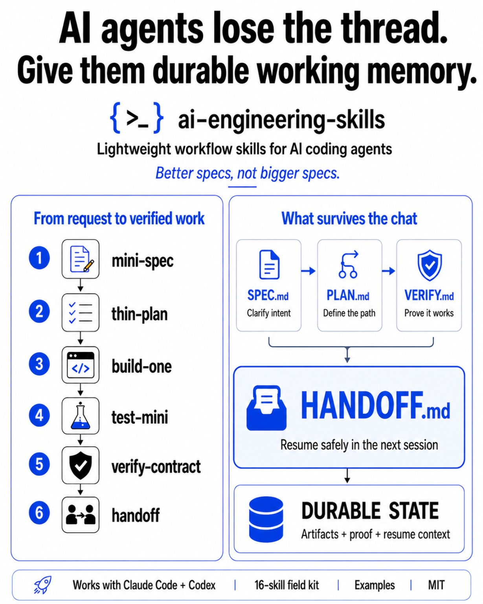
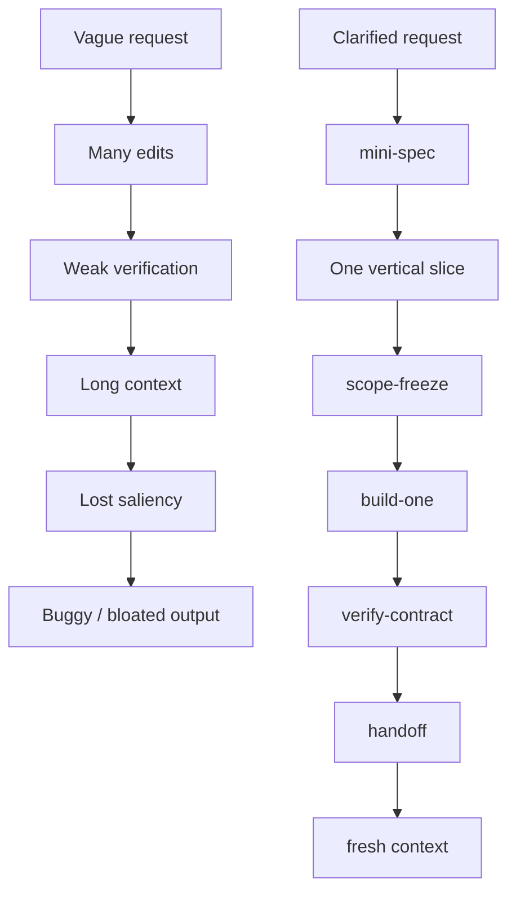

# AI Engineering Skills

[](https://github.com/tmusser/ai-engineering-skills/actions/workflows/ci.yml)
[](LICENSE)
[](https://github.com/tmusser/ai-engineering-skills/releases)
[](https://github.com/tmusser/agent-workflow-bench)

<!-- markdownlint-disable MD013 -->

ai-engineering-skills is the control layer for coding agents.
It keeps Claude Code, Codex CLI, and similar agents bounded, verified, and
resumable through lightweight workflow gates.

One human sets direction and boundaries; one agent executes inside them.

## Start here

Use this repo when a coding task needs bounded scope, verification, and a resumable
handoff, but is too small for a full PRD.

The smallest useful loop is:

```text
mini-spec -> scope-freeze -> build-one -> verify-contract -> handoff
```

That loop helps agents stop wandering, prove what changed, and leave enough state
for the next session to continue safely.

When the right route is not obvious, start with `ceremony-budget`: a short
pre-flight that chooses the smallest workflow that still buys back enough
attention and safety.

## Try it in 60 seconds

Clone the repo and install the starter set:

```bash
git clone https://github.com/tmusser/ai-engineering-skills.git
cd ai-engineering-skills
./install.sh --claude-user --only mini-spec,scope-freeze,build-one,verify-contract,handoff
./install.sh --codex-user --only mini-spec,scope-freeze,build-one,verify-contract,handoff
```

Prompt to give an agent:

```text
Use mini-spec, scope-freeze, build-one, verify-contract, and handoff for this bug fix.
```

Or let the agent route first:

```text
Use ceremony-budget first, then run only the smallest safe route.
```

Expect a `SPEC.md` or equivalent contract, a verification record, and a `HANDOFF.md`
that lets the next session resume without re-deriving the work.

Use `test-mini` as an optional add-on when the slice needs focused deterministic tests.

Use `ceremony-budget` as an optional front door when you are unsure whether the
task is a patch, one slice, a mini workflow, or a fuller guarded route.

## Starter set

Recommended starter set:

* `mini-spec`
* `scope-freeze`
* `build-one`
* `verify-contract`
* `handoff`

`thin-plan` is recommended when a slice needs more shape, but it is intentionally
not part of the absolute starter path.

`ceremony-budget` is also intentionally outside the absolute starter path. It is
an optional router that helps choose whether the starter set is even warranted.

For project-scoped installs, templates, and the raw Python installers, see
[Claude Code installation](docs/claude-code-installation.md) and
[Codex installation](docs/codex-installation.md).

Those docs cover `scripts/install_claude_code.py`, `scripts/install_codex.py`,
`AI_ENGINEERING_SKILLS_VERSION.json`, `--dry-run`, `--backup`, `--force`, `--only`,
`--uninstall`, and `--include-templates`.

## Agent support

| Agent | Support level | Notes |
| ----- | ------------- | ----- |
| Claude Code | First-class / primary target | Dedicated install docs and workflow examples. |
| Codex CLI | First-class / supported docs | Dedicated install docs and workflow examples. |
| Other markdown-capable coding agents | Experimental / manual | Skills are plain Markdown folders, but validation may be partial. |
| IDE assistants | Manual artifact workflow | Use the same files and prompts by hand; no agent-specific install path is assumed. |

Skills are portable because they are plain Markdown, but validation is strongest where
this repo has explicit install and docs coverage.

## Complements sandboxing and observability

Runtime tools can help isolate where an agent runs and observe what it does. This repo
sits one layer above that: it defines the task contract, scope boundary, verification
evidence, and handoff state. Sandbox and observability tools can fit into that runtime
layer, but they are not required for this workflow.

ai-engineering-skills is not a replacement for sandboxing, secret scanning,
permissions, or runtime isolation. It is a workflow layer that helps agents stay
bounded and resumable while those controls handle execution safety.



## What it creates

| Artifact     | What it means               |
| ------------ | --------------------------- |
| `SPEC.md`    | Current contract            |
| `VERIFY.md`  | Proof ledger / verify gate  |
| `HANDOFF.md` | Fresh-session resume packet |

## What you can do

Use the smallest route that fits.

| Need | Skill route |
| ---- | ----------- |
| Turn a messy feature request into a safe coding task | `grill-with-docs-lite` -> `mini-spec` |
| Prevent unrelated edits | `scope-freeze` |
| Implement one vertical slice | `build-one` |
| Verify before calling done | `test-mini` -> `verify-contract` |
| Resume in a fresh session | `handoff` |
| Diagnose repeated agent loops | `diagnose-loop` |
| Capture bugs cleanly | `bug-capture` |

## Why this exists

AI coding agents are powerful, but sessions still fail for predictable reasons:

* vague requests become plausible but wrong plans
* scope expands quietly
* weak verification gets accepted as completion
* long contexts hide the important constraint
* handoff state disappears between sessions

`ai-engineering-skills` gives the human and agent shared boundaries, checks, and
durable artifacts. It reduces risk, but it does not replace judgment.

| Common failure mode                                | Skill-pack response                   |
| -------------------------------------------------- | ------------------------------------- |
| Vague ask, hidden assumptions, or missing boundary | `grill-with-docs-lite` -> `mini-spec` |
| Scope expands while coding                         | `scope-freeze`                        |
| Change is treated as done without evidence         | `test-mini` -> `verify-contract`      |
| Fresh session loses the thread                     | `handoff`                             |

This is not just a prompt pack. Skills make behavior repeatable across sessions,
templates preserve state, and verification records make claims auditable. See
[Why skills, not prompts](docs/why-skills-not-prompts.md).

## Evidence

**Proof artifact:** this repo is evaluated by
[`agent-workflow-bench`](https://github.com/tmusser/agent-workflow-bench), a small
standalone benchmark for agent skills, verification artifacts, and fresh-session
resumability.

The benchmark asks a narrower question: when an agent completes messy technical
work, does it leave enough verified context for another fresh session to trust,
audit, and continue it?

| Task                                     | What it shows                                                                                               |
| ---------------------------------------- | ----------------------------------------------------------------------------------------------------------- |
| Task 4 — Impossible Churn Regression     | Skill-routed runs can leave durable context for audit/resume.                                               |
| Task 5 — Fake Data Campaign Lift Trust   | Clearer audit trails help inspection, but do not guarantee correctness.                                     |
| Task 7 — Dashboard Export Scope Pressure | Stronger settings saturated on behavior; weaker settings exposed compatibility and test-integrity failures. |

Supported claims:

* auditability
* verification discipline
* resumability

Not supported:

* broad pass-rate superiority
* guaranteed correctness
* universal behavior improvement

The Task 7 follow-up suggested the highest-leverage improvement was not heavier
skills, but sharper invalidation: compatibility probes, diff guards, and
`REVIEW_REQUIRED` states.

See [docs/benchmark-findings.md](docs/benchmark-findings.md) for the fuller pilot
notes.

## Skill map

See [docs/skill-map.md](docs/skill-map.md) for the routing diagram, context-pressure
layer, failure-mode diagram, and workflow recipes.

## The failure mode this avoids



This is the shape the repo is trying to prevent. For the full routing map, see
[docs/skill-map.md](docs/skill-map.md).

## How this is different

* Raw prompting gives instructions. This repo leaves durable artifacts.
* Plan Mode approves a plan. This repo adds earlier and later gates.
* Chat scrollback disappears. Files survive the session.

## Common objections

### Isn't this just better prompting?

Better prompts help, but the artifact trail is the leverage: specs, scope boundaries,
verification records, and handoff notes.

### Is this process theater?

It can be if you use too much of it. Start with the five-gate starter and skip the
workflow for tiny reversible edits.

### Will agents ignore the skills?

Sometimes. Skills do not make agents obey. They make expected behavior explicit,
inspectable, and easier to correct when the agent drifts. See
[Limitations](LIMITATIONS.md) for the honest failure modes.

## Context-pressure control layer

Four skills form the backbone for resilient agent sessions:

* `scope-freeze` — limits blast radius before work
* `verify-contract` — records evidence after work
* `context-check` — detects drift during work
* `handoff` — preserves durable state between sessions

Together they support bounded execution and verifiable progress.

`lean-mode` is optional. It changes communication density, not the project workflow.
Use it when token budget matters, then switch back to full reasoning when ambiguity,
safety, or trade-offs require more explanation.

`context-check` is an optional passive guardrail. It watches for drift, compaction
pressure, and active-mode loss, then recommends the smallest corrective action.

For scheduled or delegated tool-using runs, see
[Agent-worker safety](docs/agent-worker-safety.md) before giving a workflow write
access.

## Workflow recipes

See [docs/recipes.md](docs/recipes.md) for the small-project, debug, ML/dashboard,
analytical, and cross-functional recipes.

For the routing logic behind those recipes, see
[docs/ceremony-budget.md](docs/ceremony-budget.md).

For an isolated git worktree task, see
[docs/worktree-agent-run.md](docs/worktree-agent-run.md).

## Ceremony ladder

Use the smallest workflow that still feels safe.

`ceremony-budget` is the optional entry move before this ladder. It should usually
output a short decision, not a new durable artifact.

### Level 0 — Patch

Tiny reversible edit. Run one sanity check. Record the result.

### Level 1 — Micro

One bounded slice. `inline scope-freeze -> build-one -> verify-contract`.

### Level 2 — Mini

Small vertical slice. `mini-spec -> optional thin-plan -> scope-freeze ->
build-one -> test-mini -> verify-contract`.

Analytical deliverables such as sizing memos or scenario tables often fit Level 2.

### Level 3 — Full

User-facing, scheduled, autonomous, decision-impacting, data-sensitive, or
multi-slice work. `grill-with-docs-lite -> mini-spec -> checklist-mini -> thin-plan
-> scope-freeze -> analyze-mini -> build-one -> test-mini -> verify-contract ->
ship-mini -> handoff`.

### Below Level 0 — Prompt primitives

Some tasks do not need a skill, artifact, or workflow gate. For quick steering moves
like “Find the lie,” “Smallest safe diff,” or “Test the tests,” use prompt primitives
instead. See [docs/recipes.md#prompt-primitives](docs/recipes.md#prompt-primitives).

## Optional bundles

Use the smallest bundle that fits. See [docs/bundles.md](docs/bundles.md) for
copy-paste install sets for starter, bugfix, ML/data science, dashboard,
agent-worker, and full governance workflows.

## Demo


This sanitized terminal demo shows a bounded cycle using fake data and simulated
agent output. It is generated from `demo/demo.tape` using VHS, so it is reproducible
without private code, private data, or API calls.

Render it locally with:

```bash
scripts/render_demo.sh
```

## Further reading

* Slash-style usage: see the install docs and skill command examples.
* anti-patterns: each skill documents common failure modes to avoid.
* Loop governance: see [docs/loop-governance.md](docs/loop-governance.md).
* Cross-functional infrastructure coordination: see
  [docs/recipes.md](docs/recipes.md).

## Status

This is a practical workflow pack, not a guarantee that agents will behave. The
best results still come from a human who can set boundaries, inspect evidence, and
decide when to escalate ceremony.

The benchmark evidence supports auditability, verification discipline, and
resumability. It does not show broad pass-rate superiority, and `ceremony-budget`
should not be read as "always do more process." The point is to know when not to
use the heavier parts of this repo.
