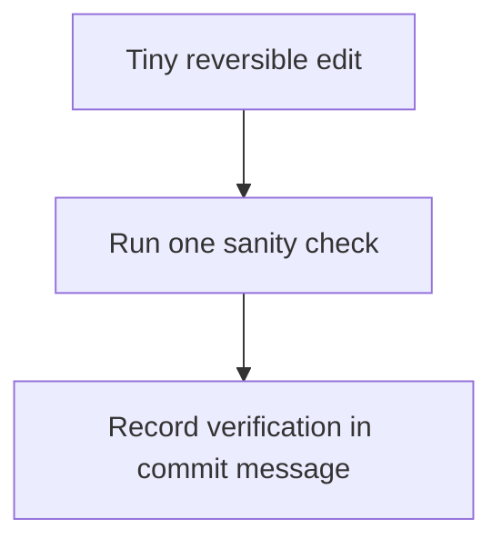
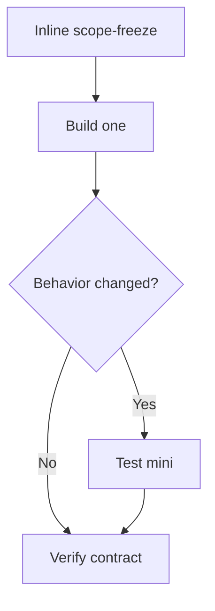
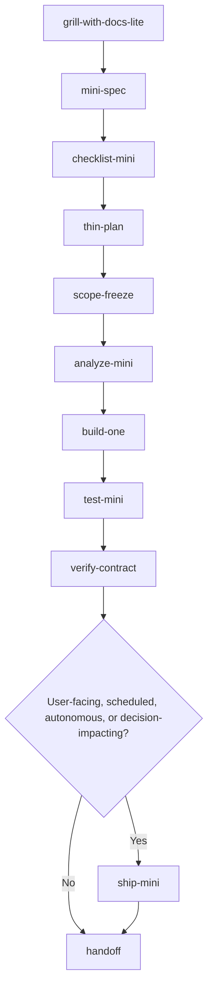
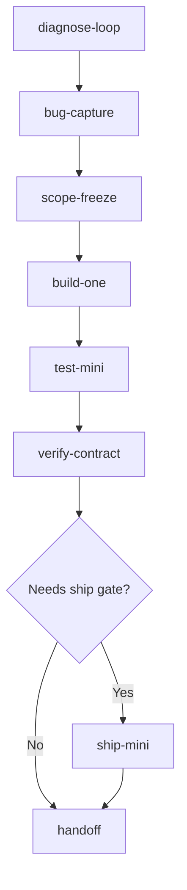
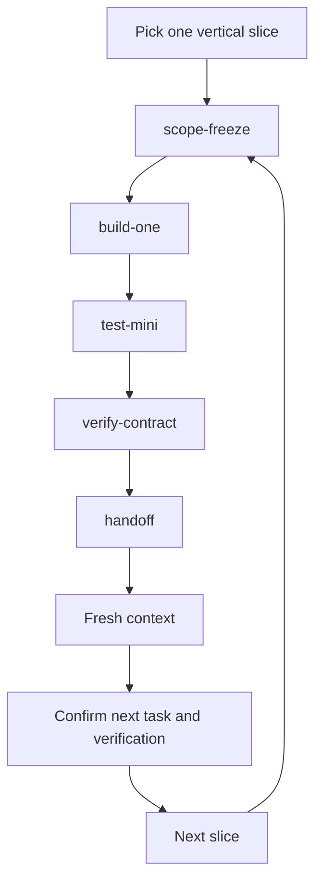
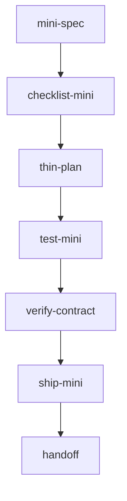
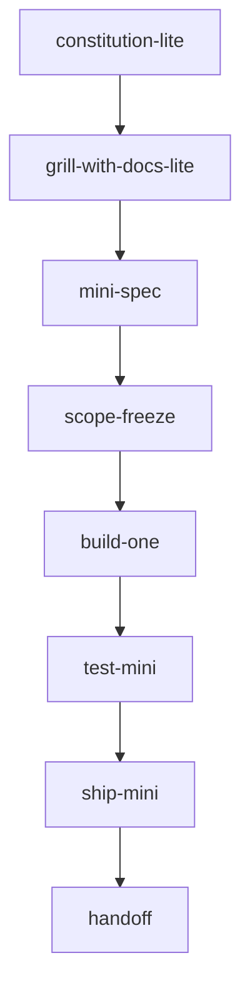

# Workflow Recipes

Use the smallest workflow that fits the task. These recipes show common routes through the skills.

## Level 0 — Patch

Use for tiny reversible edits that only need one sanity check.



## Level 1 — Micro behavior change

Use for small bounded behavior changes that still fit in one slice.



## Analytical deliverable / scenario memo

Use for opportunity sizing, scenario analysis, stakeholder memos, SQL → CSV → Python → Markdown analysis, or a transcript or meeting request that needs a structured deliverable.

```text
grill-with-docs-lite
→ mini-spec
→ checklist-mini
→ thin-plan
→ build-one × slices
→ test-mini
```

Optional gates:

- Use `scope-freeze` if working inside an existing repo with shared modules, configs, or broad blast radius.
- Use `verify-contract` if the proof needs to become a durable audit artifact.
- Use `ship-mini` if the output will be committed, reused, scheduled, automated, published, or treated as a source of truth.
- Use `handoff` only if another session or agent will continue.

Deterministic checks can include SQL row and count sanity checks, exact arithmetic checks, banned-word or framing checks, scenario table assertions, and methodology bridge checks between different metric definitions.

## When to skip steps

- Skip `mini-spec` when the change is mechanical, single-purpose, and unambiguous.
- Skip `thin-plan` when there is only one slice.
- Skip `scope-freeze` when the workspace is already isolated and the blast radius is obvious.
- Use test-mini for correctness checks; use verify-contract when the verification evidence itself needs to be durable.
- Skip `test-mini` only when no behavior changed or when a runnable test is not practical; use a smoke path instead.
- Use `ship-mini` when the output becomes a committed, shared, scheduled, automated, published, or source-of-truth artifact.
- Skip `ship-mini` only when the output is not user-facing, scheduled, autonomous, decision-impacting, or data-sensitive.
- Use `handoff` for continuation, not completion.
- Do not skip `verify-contract` when behavior changed.

## Spike / scratchpad

Use a spike to test an idea quickly.

- Do not create `SPEC.md` or `PLAN.md`.
- Keep it in one scratch file when possible.
- Use fake or toy data.
- When the spike grows beyond its boundary, stop and promote it to Level 2 by creating `mini-spec`, `verify-contract`, and `handoff` artifacts.

## Default small-project flow

Use when a small project needs enough structure to ship safely.



## Debug / bugfix flow

Use when behavior is failing and feature work should pause.



## Fresh-context development loop

Use when long context is starting to drift or another session will continue.



## ML / dashboard workflow

Use when outputs may influence analysis, metrics, model decisions, or stakeholder review.



Check fixture data, row counts, null checks, metric deltas, and screenshot or smoke verification.

## Agent worker workflow

Use when an agent will read queues, boards, tickets, files, or tools and take bounded action.



Define autonomy level, allowed tools, forbidden actions, rollback, and logs.
