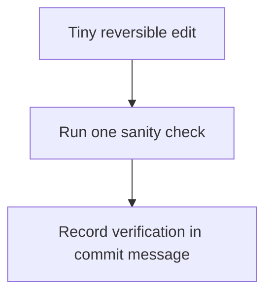
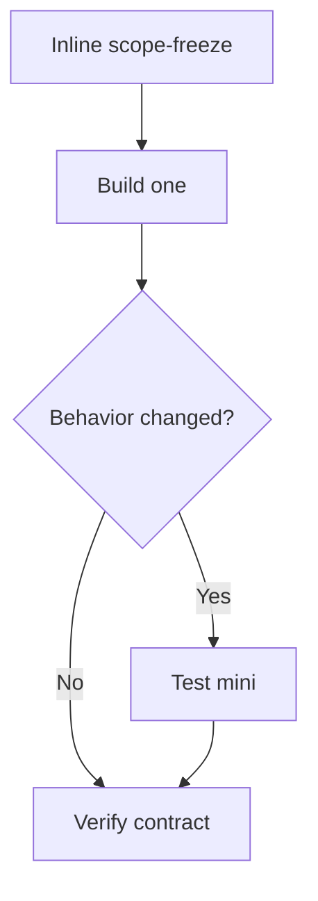
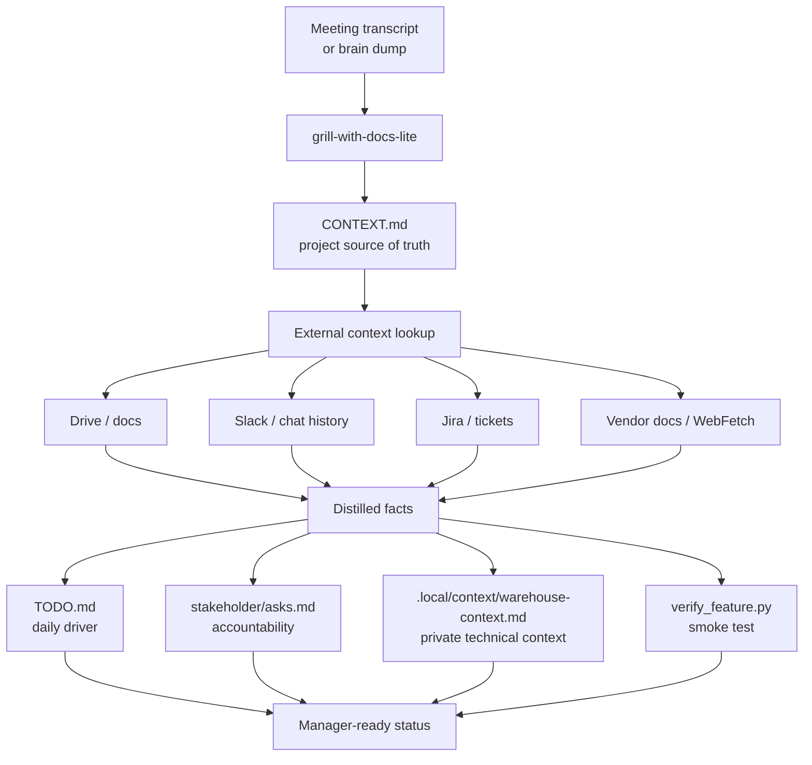
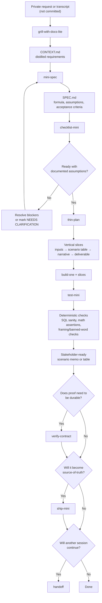
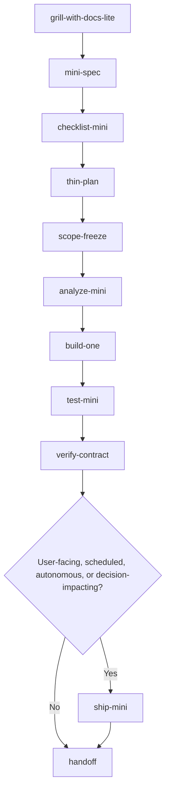
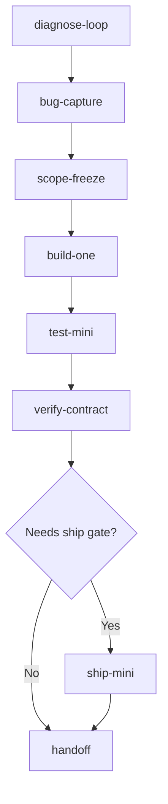
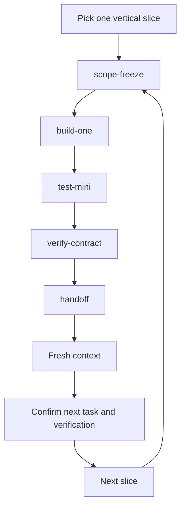
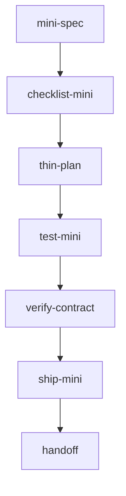
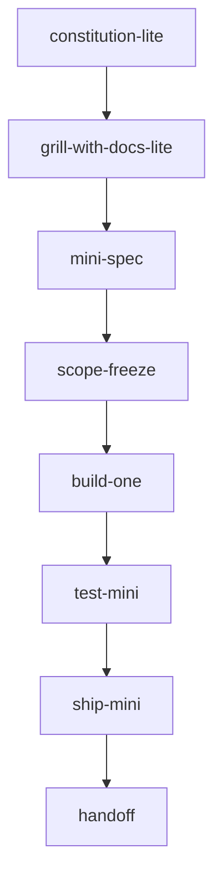

# Workflow Recipes

Use `ceremony-budget` first when the right route is not obvious. It should
usually produce a short decision block, not a durable file.

Use the smallest workflow that fits the task. These recipes show common routes
through the skills.

For an isolated git worktree task, see [Worktree Agent Run](worktree-agent-run.md).

## Ceremony budget entry move

Use this before choosing a recipe when the task could plausibly fit more than one
level.

```text
ceremony-budget
→ choose Level 0 / 1 / 2 / 3
→ run only the selected route
```

Rule: spend ceremony only when it buys back attention or safety.

## Level 0 — Patch

Use for tiny reversible edits that only need one sanity check.

Typical `ceremony-budget` output:

```text
Level: 0
Use: direct patch -> one sanity check
Skip: mini-spec, thin-plan, handoff
Proof reserve: one command or smoke path
Stop rule: stop after the sanity check passes and no broader seam moved
```



## Level 1 — Micro behavior change

Use for small bounded behavior changes that still fit in one slice.

Typical `ceremony-budget` output:

```text
Level: 1
Use: inline scope-freeze -> build-one -> verify-contract
Skip: mini-spec unless ambiguity appears, thin-plan, handoff unless another session will continue
Proof reserve: one bounded verification record tied to the changed behavior
Stop rule: stop after the slice is verified and no continuation risk remains
```

## Level 2 — Mini slice

Use for small vertical slices with meaningful ambiguity, moderate scope pressure,
or a real chance that weak proof will be mistaken for done.

Typical `ceremony-budget` output:

```text
Level: 2
Use: mini-spec -> optional thin-plan -> scope-freeze -> build-one -> test-mini -> verify-contract
Skip: checklist-mini, analyze-mini, ship-mini unless the risk profile changes
Proof reserve: explicit acceptance criteria plus deterministic verification evidence
Stop rule: stop after the slice is verified or pause if the task expands beyond one safe slice
```

Common triggers:

- acceptance criteria need to be written down
- compatibility seams or test meaning need to be preserved
- the task can drift unless the slice is named first
- another person may inspect the proof later

## Level 3 — Full guarded workflow

Use for user-facing, scheduled, autonomous, decision-impacting, data-sensitive,
or multi-slice work.

Typical `ceremony-budget` output:

```text
Level: 3
Use: grill-with-docs-lite -> mini-spec -> checklist-mini -> thin-plan -> scope-freeze -> analyze-mini -> build-one -> test-mini -> verify-contract -> ship-mini -> handoff
Skip: only skills that clearly do not apply to this task
Proof reserve: durable verification, explicit guardrails, and safe resume state
Stop rule: stop at the next gate when verification, risk, or resume state is not strong enough
```



## Cross-functional infrastructure coordination

Use when a project spans multiple teams, external owners, tickets, meetings, credentials, platform details, or unresolved technical access questions.

```text
grill-with-docs-lite
→ external context lookup
→ CONTEXT.md
→ TODO.md
→ stakeholder ask files
→ verification scripts
→ private context packs
```



Use `.local/` for private technical context and keep it gitignored.

## Analytical deliverable / scenario memo

Use for opportunity sizing, scenario analysis, stakeholder memos, SQL → CSV → Python → Markdown analysis, or a transcript or meeting request that needs a structured deliverable.



```text
grill-with-docs-lite
→ mini-spec
→ checklist-mini
→ thin-plan
→ build-one × slices
→ test-mini
```

Optional gates:

- Use `scope-freeze` if working inside an existing repo with shared modules, configs, or broad blast radius.
- Use `verify-contract` if the proof needs to become a durable audit artifact.
- Use `ship-mini` if the output will be committed, reused, scheduled, automated, published, or treated as a source of truth.
- Use `handoff` only if another session or agent will continue.

Deterministic checks can include SQL row and count sanity checks, exact arithmetic checks, banned-word or framing checks, scenario table assertions, and methodology bridge checks between different metric definitions.

## When to skip steps

- Skip `ceremony-budget` when the route is already obvious.
- Skip `mini-spec` when the change is mechanical, single-purpose, and unambiguous.
- Skip `thin-plan` when there is only one slice.
- Skip `scope-freeze` when the workspace is already isolated and the blast radius is obvious.
- Use test-mini for correctness checks; use verify-contract when the verification evidence itself needs to be durable.
- Skip `test-mini` only when no behavior changed or when a runnable test is not practical; use a smoke path instead.
- Use `ship-mini` when the output becomes a committed, shared, scheduled, automated, published, or source-of-truth artifact.
- Skip `ship-mini` only when the output is not user-facing, scheduled, autonomous, decision-impacting, or data-sensitive.
- Use `handoff` for continuation, not completion.
- Do not skip `verify-contract` when behavior changed.

## Escalation and de-escalation triggers

Escalate ceremony when:

- ambiguity is causing re-interpretation
- scope is drifting past the intended slice
- proof is too weak to support the claim of done
- context is getting long enough to risk losing the real constraint
- another session will need to resume safely
- the change is hard to undo or affects decisions, users, public interfaces, or
  shared data

De-escalate ceremony when:

- the task is still a tiny reversible patch
- the next artifact would only repeat information already made explicit
- a smaller proof reserve covers the real risk
- a larger workflow was chosen out of habit rather than task pressure

## Resume and verify-before-edit stop rules

- Stop and verify before editing when the user request is still ambiguous.
- Stop and verify before editing when compatibility seams, test meaning, or data
  semantics are unclear.
- Stop and hand off instead of continuing when another session can resume more
  safely from a verified state than from a longer live thread.
- Stop escalating when the next route is clear and the remaining ceremony would
  not buy back more safety.

## Prompt primitives

Not every useful agent instruction needs to become a full skill.

Some interventions are intentionally tiny: one-line review postures that steer an agent without creating artifacts, workflow state, or ceremony. Use them when you want a sharper pass on code, plans, tests, or scope, but the task does not justify a structured skill.

Examples:

- **Adversarial review, no compliments** — find concrete reasons this could fail.
- **Find the lie** — surface hidden assumptions and unproven claims.
- **Regression hunt** — look for existing behavior this may have broken.
- **Smallest safe diff** — reduce the change to the minimum viable fix.
- **Test the tests** — check whether the tests prove the behavior that matters.
- **Fresh maintainer pass** — review for future readability and modification risk.
- **Failure-mode sweep** — test messy, missing, malformed, stale, or large inputs.
- **Contract check** — compare implementation against the stated intent.
- **Evidence-only review** — separate verified facts from plausible claims.
- **Kill the plan** — try to invalidate the plan before implementation.

These are not full skills because they do not define durable workflows. They are lightweight steering primitives: fast, disposable, and useful inside many different skills.

## Communication density

Use `lean-mode` to keep routine interactions short. Do not use it to compress away assumptions, risks, verification, or unresolved questions.

Use `context-check` as a passive guardrail when threads get long, facts repeat, or handoff, fork, or restart is being considered. It recommends continue, freeze scope, update durable state, fork, handoff, or restart.

## Spike / scratchpad

Use a spike to test an idea quickly.

- Do not create `SPEC.md` or `PLAN.md`.
- Keep it in one scratch file when possible.
- Use fake or toy data.
- When the spike grows beyond its boundary, stop and promote it to Level 2 by creating `mini-spec`, `verify-contract`, and `handoff` artifacts.

## Default small-project flow

Use when a small project needs enough structure to ship safely.



## Debug / bugfix flow

Use when behavior is failing and feature work should pause.



## Fresh-context development loop

Use when long context is starting to drift or another session will continue.



## Context pressure check

Use when the thread is getting sticky, facts are being restated, active modes may be lost, or debugging has multiple hypotheses.

```text
context-check
→ update durable state if needed
→ handoff or fork only when risk is medium/high
```

Do not run this as ceremony. Use it only when context starts to distort execution.

Task 7 style scope pressure often belongs here: if compatibility seams, test
integrity, or public behavior may be drifting, stop the loop, tighten the route,
and reserve stronger proof before continuing.

## Context hydration

For a deterministic packet that pulls only the smallest relevant markdown excerpts,
see [Context Hydration](context-hydration.md).

## ML / dashboard workflow

Use when outputs may influence analysis, metrics, model decisions, or stakeholder review.



Check fixture data, row counts, null checks, metric deltas, and screenshot or smoke verification.

For metrics, experiments, campaign lift, notebooks, or decision-impacting summaries,
start with [Data Trust Pass](#data-trust-pass).

## Data Trust Pass

Use for metrics, campaign lift, experiments, dashboards, notebooks, model evaluation,
and decision-impacting summaries.

Do not compute or share the headline metric until the grain, denominator, time
window, exclusions, and claim boundary are explicit.

Required checks:

- metric grain
- numerator
- denominator
- aggregation level
- duplicate rows or duplicate keys
- synthetic/test/QA rows
- invalid dates or analysis windows
- denominator variation by arm/phase/segment/window
- assignment balance
- sample size issues
- leakage or post-treatment fields
- unsupported causal language
- verification evidence

Outputs:

- For small tasks, add a Data Trust section to `VERIFY.md`.
- For larger tasks, create `DATA_AUDIT.md`.
- Record allowed claims and blocked claims before writing an executive summary.

Anti-patterns:

- treating public schema tests as analysis proof
- computing lift before checking denominator consistency
- silently filtering bad rows and still making a confident claim
- using future/post-treatment fields as causal evidence
- saying caused/proved/lift without design evidence

## Agent worker workflow

Use when an agent will read queues, boards, tickets, files, or tools and take bounded action.



Define autonomy level, allowed tools, forbidden actions, rollback, and logs.
