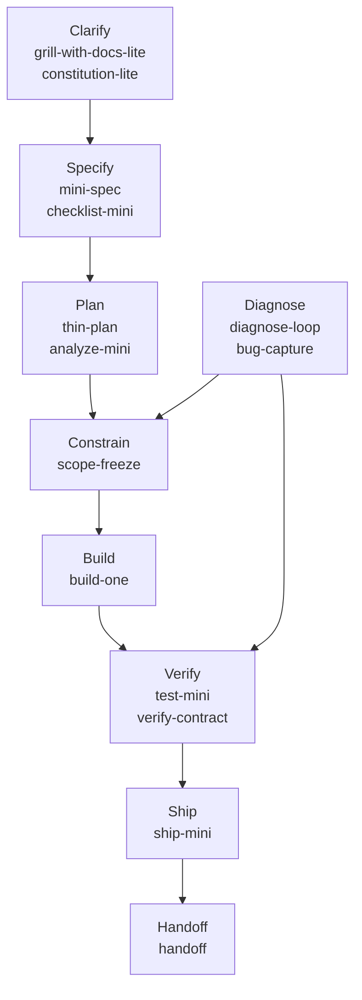
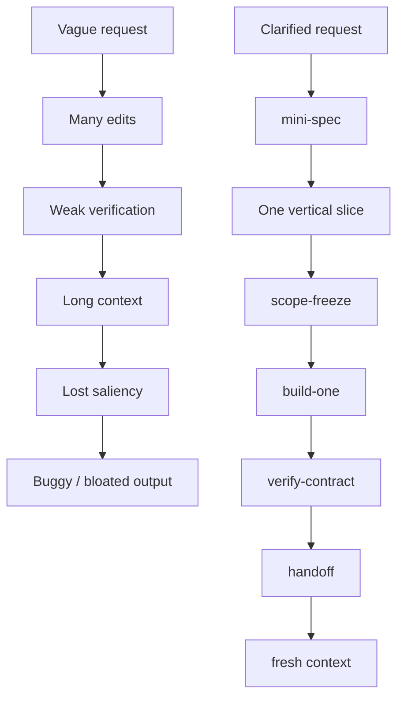

# Skill Map

Use this repo as a small operating loop for bounded AI-assisted technical work.

## Routing map

## Context-pressure control layer

- `scope-freeze` limits blast radius before work.
- `verify-contract` records evidence after work.
- `context-check` detects drift during work.
- `handoff` preserves durable state between sessions.

Together they support bounded execution and verifiable progress.

## Failure mode diagram

## Workflow recipes

See [docs/recipes.md](recipes.md) for small-project, debug, ML/dashboard, analytical,
and cross-functional recipes.

For scheduled or delegated tool-using runs, see
[docs/agent-worker-safety.md](agent-worker-safety.md) before giving a workflow write
access.
