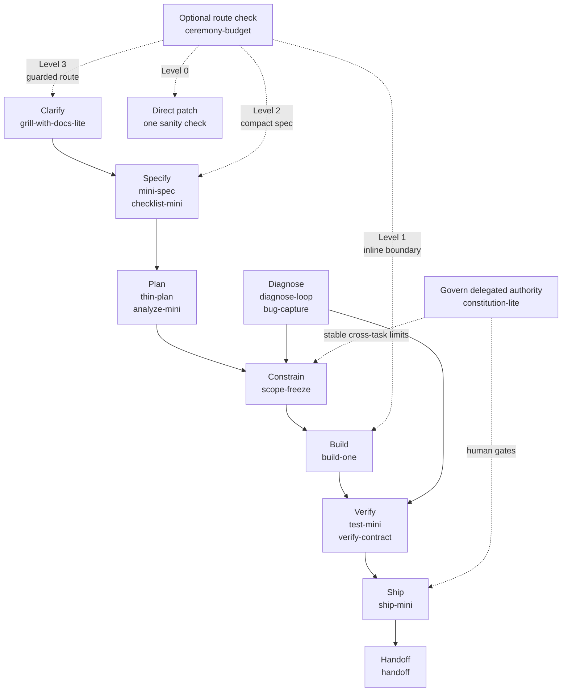
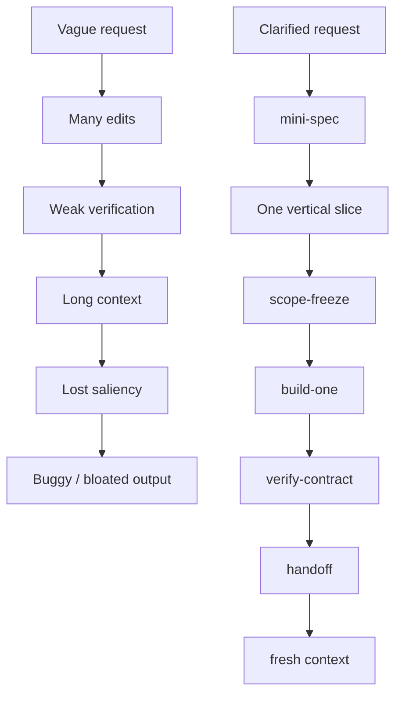

# Skill Map

Use this repo as a small operating loop for bounded AI-assisted technical work.

## Routing map

`ceremony-budget` is an optional pre-flight router. It can bypass most of the map
for a tiny patch, enter at build for a low-ambiguity micro change, enter at specify
for a compact mini slice, or select the fuller guarded route.

`grill-with-docs-lite` is a bounded pre-spec contradiction hunt, not a domain-modeling
interview. It reads the smallest relevant source set, separates source-backed facts from
user decisions and assumptions, asks only blocking questions, and emits a compact
`CLARIFICATION DELTA` for `mini-spec`. If the work needs glossary-building, ADRs, or an
open-ended decision tree, route to a fuller clarification workflow instead of expanding
the lite pass.

`constitution-lite` is not a second `CLAUDE.md` or `AGENTS.md`. Native project instructions
own architecture, commands, conventions, and ordinary team preferences. The constitution
owns only stable cross-task authority limits for delegated work: non-negotiable `MUST` /
`MUST NOT` rules, protected boundaries, and decisions that require a human gate. Task-local
requirements still belong in `SPEC.md`, `scope-freeze`, or `SHIP.md`.

The five-skill starter is a durable default loop, not the minimum process for every
task. Installing a bundle does not require invoking every installed skill.

- Add `test-mini` when focused deterministic tests add value.
- Use `verify-contract` when the proof itself should be explicit and durable.
- Use `handoff` for continuation risk, not as a completion ritual.

## Context-pressure control layer

- `scope-freeze` limits blast radius before work.
- `verify-contract` records evidence after work.
- `context-check` detects drift during work.
- `tool-noise-guard` compacts repeated tool envelopes and suppresses unjustified re-fetches.
- `handoff` preserves durable state between sessions.

`tool-noise-guard` is optional and passive. It protects the carry-forward representation
of tool state; it does not retroactively remove raw tool output already injected by the
runtime. See [Tool Noise Guard](tool-noise-guard.md).

Together these controls support bounded execution, dense working context, and verifiable
progress.

## Failure mode diagram

## Workflow recipes

See [docs/recipes.md](recipes.md) for small-project, debug, ML/dashboard, analytical,
and cross-functional recipes.

For scheduled or delegated tool-using runs, see
[docs/agent-worker-safety.md](agent-worker-safety.md) before giving a workflow write
access.
