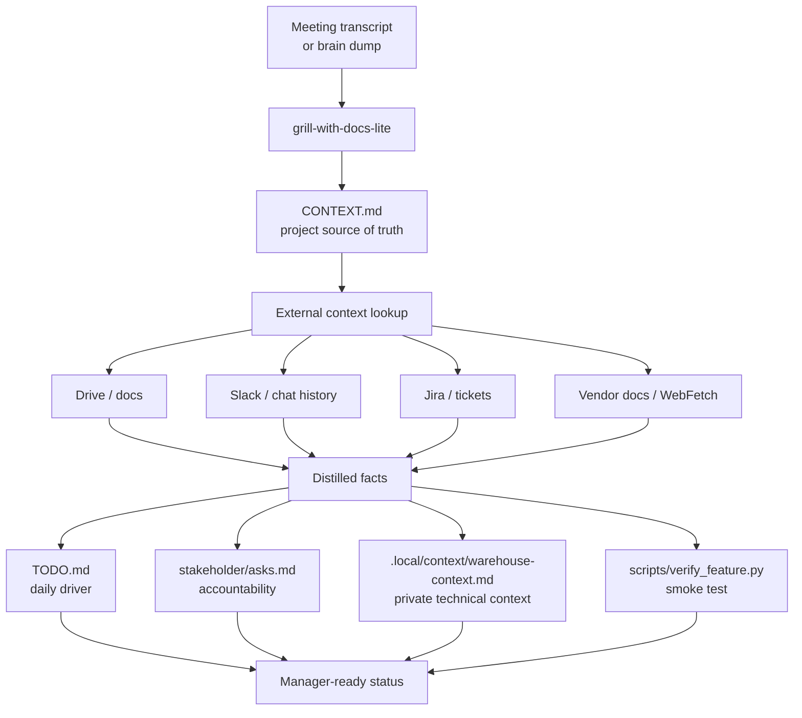

# Example: Cross-Functional Infrastructure Coordination

Use this pattern when a project has multiple stakeholders, async dependencies, technical unknowns, and no single source of truth.

## When to use

Use it when infrastructure work spans teams, approvals, tickets, meetings, credentials, platform details, or unresolved access questions.

## Starting point

Start from a meeting transcript, a long chat thread, or a brain dump. The goal is to turn scattered context into files that can survive handoff.

## Recommended flow

```text
grill-with-docs-lite
→ external context lookup
→ CONTEXT.md
→ TODO.md
→ stakeholder ask files
→ private context pack
→ verification script
→ manager-ready status
```



## Files created

- `CONTEXT.md` for project state and open questions
- `TODO.md` for daily actions and waiting-on items
- `stakeholder/asks.md` files for accountability and follow-up
- `.local/context/` for private, gitignored technical context
- `scripts/verify_feature.py` for deterministic checks or smoke tests

## Tool/context lookup pattern

Use MCP or other connected tools to pull facts from the places where they already live:

- Drive or docs for shared project notes
- Slack or chat history for decisions and thread context
- Jira or tickets for owners, status, and acceptance details
- Vendor docs or web lookup for platform limits and supported paths

Capture the results in files, not in chat.

## Verification pattern

Use a small verification script that checks the new access path or workflow end to end. Keep it deterministic when possible.

Examples:

- write a small record and read it back
- confirm a query returns the expected row count
- verify a credential or service account can actually do the needed work
- check a generated file or report has the expected shape

## Folder structure

```text
project-name/
  CONTEXT.md
  TODO.md
  platform-admin/
    asks.md
  engineering/
    asks.md
  manager/
    asks.md
  .local/
    context/
      warehouse-context.md
  scripts/
    verify_feature.py
```

Keep `.local/` gitignored. Use it for private technical context such as profiles, buckets, workgroups, schemas, auth notes, or environment-specific boilerplate.

## Lessons learned

- Put the facts in files so the next session does not need the full conversation.
- Separate asks by stakeholder so ownership stays visible.
- Keep private technical context local and explicit.
- Use a verification script early so access problems surface as small fixes.

## Anti-patterns

- Leaving important facts trapped in chat history.
- Mixing private technical notes into public project files.
- Treating a manager update as a substitute for the source of truth.
- Skipping verification because the setup looks complete.
